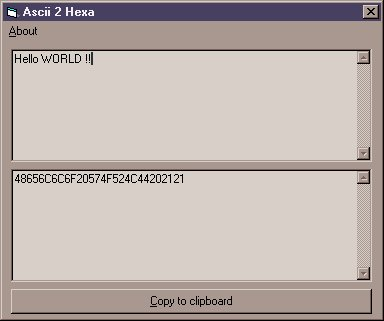



## Ascii 2 Hexa

### Description

Easily know the hexa code of what you type in ascii mode.
 
### More Info
 

             |
---                |---
**Submitted On**   |2001-10-28 18:40:48
**By**             |[Gustavo Becerra](https://github.com/Planet-Source-Code/PSCIndex/blob/master/ByAuthor/gustavo-becerra.md)
**Level**          |Beginner
**User Rating**    |4.5 (18 globes from 4 users)
**Compatibility**  |VB 3\.0, VB 4\.0 \(16\-bit\), VB 4\.0 \(32\-bit\), VB 5\.0, VB 6\.0
**Category**       |[Miscellaneous](https://github.com/Planet-Source-Code/PSCIndex/blob/master/ByCategory/miscellaneous__1-1.md)
**World**          |[Visual Basic](https://github.com/Planet-Source-Code/PSCIndex/blob/master/ByWorld/visual-basic.md)
**Archive File**   |[Ascii 2 He3162710282001\.zip](https://github.com/Planet-Source-Code/gustavo-becerra-ascii-2-hexa__1-28482/archive/master.zip)

